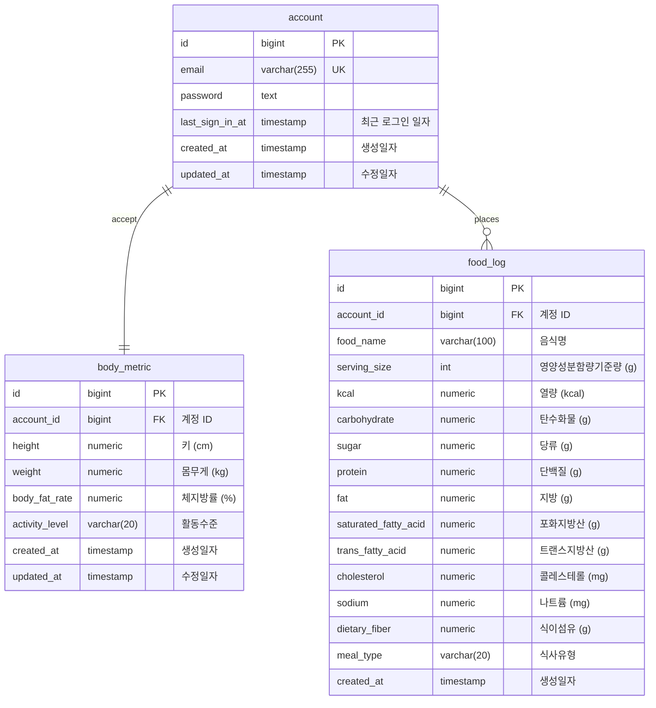

# 🍎 Health Nutrition Tracker - 개인 맞춤형 건강 트래커 백엔드

**HealthTracker**은 사용자의 체성분 데이터를 기반으로 **기초대사량** (BMR) 및 **일일 권장 섭취 칼로리** (TDEE)를 계산하고,  
사용자가 섭취한 음식을 입력하면 **실제 섭취 칼로리 대비 목표치**를 시각적으로 보여주는 개인 건강 관리 앱입니다.

**공공데이터포털 Open API**를 통해 **식품영양성분 데이터**를 활용합니다.

---

## 🚀 기술 스택

| 구분 | 기술 |
|------|------|
| Language | **Kotlin v1.8.21** | 
| Framework | **Spring Boot v3.0.6** | 
| Database | **PostgreSQL v16** |
| ORM | **Spring Data JPA (Hibernate)** | 
| API Docs | **Spring REST Docs** |
| Build Tool | **Gradle (Groovy)** |
| Test | **JUnit 5** |

---

## ⚡️ 주요 기능
### 1️⃣ 사용자 프로필 관리
- 키, 체중, 체지방률 입력 → 기초대사량(BMR) 및 일일 권장 섭취 칼로리(TDEE) 계산
- 평소 활동 수준 (좌식/보통/활동적) 선택 가능

### 2️⃣ 음식 검색 및 칼로리 계산
- 공공데이터포털 Open API 연동
- 음식명 입력 시 영양성분 조회
- 음식별 1회 제공량(g) 기준 칼로리 계산

### 3️⃣ 섭취 기록 관리
- 사용자가 입력한 일일 섭취 음식 기반으로 일일 총 칼로리 합계 계산
- 일일 권장 섭취 칼로리와 비교 → 칼로리 +/- 표시

### 4️⃣ 요약 대시보드
- 오늘의 섭취 칼로리 vs 일일 권장 섭취 칼로리
- 오늘의 섭취 주요 영양소 비율 (탄/단/지)
- 주간 섭취 주요 영양소 비율

---

## 🗂️ 패키지 구조

```
└── com
    └── healthnutrition
        ├── account
        │   ├── domain
        │   │   └── exception
        │   ├── infrastructure
        │   │   ├── persistence
        │   │   └── web
        │   │       └── dto
        │   └── usecase
        │       └── dto
        ├── auth
        │   ├── domain
        │   ├── infrastructure
        │   │   ├── config
        │   │   └── security
        │   └── usecase
        ├── bodymetric
        │   ├── domain
        │   │   └── exception
        │   ├── infrastructure
        │   │   ├── persistence
        │   │   └── web
        │   │       └── dto
        │   └── usecase
        │       └── dto
        ├── food
        │   ├── domain
        │   │   └── exception
        │   ├── infrastructure
        │   │   ├── external
        │   │   │   └── dto
        │   │   ├── persistence
        │   │   └── web
        │   │       └── dto
        │   └── usecase
        │       └── dto
        └── global
            ├── domain
            ├── infrastructure
            │   ├── config
            │   └── persistence
            └── usecase
```

---

## 🗃️ ERD


