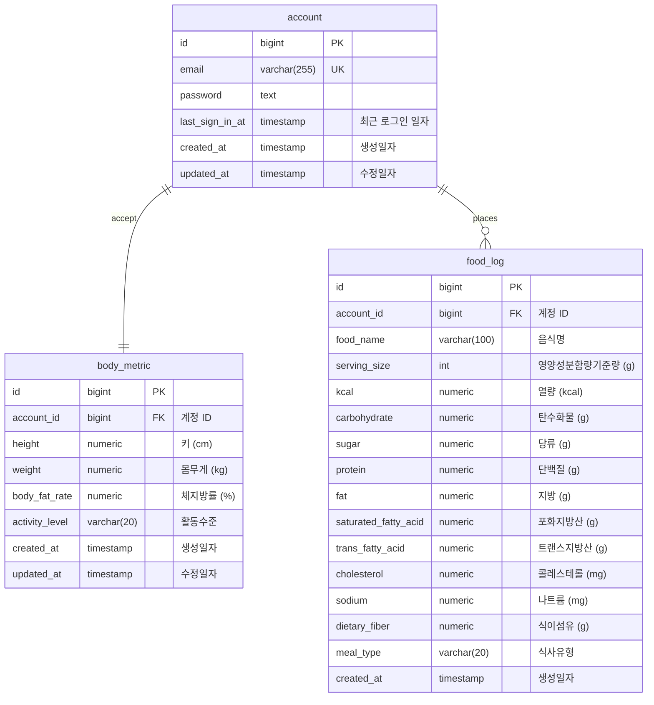

# 🍎 Health Nutrition Tracker - 개인 맞춤형 건강 트래커 백엔드

**HealthTracker**은 사용자의 체성분 데이터를 기반으로 **기초대사량** (BMR) 및 **일일 권장 섭취 칼로리** (TDEE)를 계산하고,  
사용자가 섭취한 음식을 입력하면 **실제 섭취 칼로리 대비 목표치**를 시각적으로 보여주는 개인 건강 관리 앱입니다.

**공공데이터포털 Open API**를 통해 **식품영양성분 데이터**를 활용합니다.

---

## 🚀 기술 스택

| 구분 | 기술 |
|------|------|
| Language | **Kotlin v1.8.21** | 
| Framework | **Spring Boot v3.0.6** | 
| Database | **PostgreSQL v16** |
| ORM | **Spring Data JPA (Hibernate)** | 
| API Docs | **Spring REST Docs** |
| Build Tool | **Gradle (Groovy)** |
| Test | **JUnit 5** |

---

## ⚡️ 주요 기능
### 1️⃣ 사용자 프로필 관리
- 키, 체중, 체지방률 입력 → 기초대사량(BMR) 및 일일 권장 섭취 칼로리(TDEE) 계산
- 평소 활동 수준 (좌식/보통/활동적) 선택 가능

### 2️⃣ 음식 검색 및 칼로리 계산
- 공공데이터포털 Open API 연동
- 음식명 입력 시 영양성분 조회
- 음식별 1회 제공량(g) 기준 칼로리 계산

### 3️⃣ 섭취 기록 관리
- 사용자가 입력한 일일 섭취 음식 기반으로 일일 총 칼로리 합계 계산
- 일일 권장 섭취 칼로리와 비교 → 칼로리 +/- 표시

### 4️⃣ 요약 대시보드
- 오늘의 섭취 칼로리 vs 일일 권장 섭취 칼로리
- 오늘의 섭취 주요 영양소 비율 (탄/단/지)
- 주간 섭취 주요 영양소 비율

---

## 🗂️ 프로젝트 구조

```
domain
└── src
    └── main
        └── kotlin
         └── com
             └── healthnutrition
                 ├── account
                 ├── bodymetric
                 ├── food
                 └── shared
                     └── util

application
└── src
    └── main
         └── kotlin
         └── com
             └── healthnutrition
                 ├── account
                 ├── bodymetric
                 ├── dashboard
                 ├── encryption
                 ├── food
                 └── jwt

infrastructure
└── src
    └── main
        └── kotlin
         └── com
             └── healthnutrition
                 ├── account
                 ├── bodymetric
                 ├── config
                 ├── encryption
                 └── food
    
web
└── src
    └── main
        └── kotlin
         └── com
             └── healthnutrition
                 ├── account
                 ├── bodymetric
                 ├── dashboard
                 ├── food
                 └── security
```

### 모듈 의존 방향


### web
- REST API 엔드포인트를 정의하는 모듈
- 실질적인 애플리케이션 실행부

### application
- 트랜잭션, 권한, 감사, 멱등성을 다루는 모듈
- "언제 어떤 도메인을 호출하고, 어떤 저장소를 통해 영속화하는가"를 책임

### domain
- 핵심 비즈니스 규칙, 즉 "무엇을 해야 하는가?"을 기술하는 모듈
- 프레임워크 비의존 순수 Kotlin 객체로 구성

### infrastructure
- 기술 세부사항 구현부
- JPA/SQL/Mongo 등 저장소 구현, 외부 REST API, 메시징, Mapper (Domain ↔ Entity/DTO 변환)

---

## 🗃️ ERD


```mermaid
erDiagram
    account {
        id bigint PK
        email varchar(255) UK
        password text
        last_sign_in_at timestamp "최근 로그인 일자"
        created_at timestamp "생성일자"
        updated_at timestamp "수정일자"
    }

    body_metric {
        id bigint PK
        account_id bigint FK "계정 ID"
        height numeric "키 (cm)"
        weight numeric "몸무게 (kg)"
        body_fat_rate numeric "체지방률 (%)"
        activity_level varchar(20) "활동수준"
        created_at timestamp "생성일자"
        updated_at timestamp "수정일자"
    }

    food_log {
        id bigint PK
        account_id bigint FK "계정 ID"
        food_name varchar(100) "음식명"
        serving_size int "영양성분함량기준량 (g)"
        kcal numeric "열량 (kcal)"
        carbohydrate numeric "탄수화물 (g)"
        sugar numeric "당류 (g)"
        protein numeric "단백질 (g)"
        fat numeric "지방 (g)"
        saturated_fatty_acid numeric "포화지방산 (g)"
        trans_fatty_acid numeric "트랜스지방산 (g)"
        cholesterol numeric "콜레스테롤 (mg)"
        sodium numeric "나트륨 (mg)"
        dietary_fiber numeric "식이섬유 (g)"
        meal_type varchar(20) "식사유형"
        created_at timestamp "생성일자"
    }

    account ||--|| body_metric: accept
    account ||--o{ food_log: places
```
